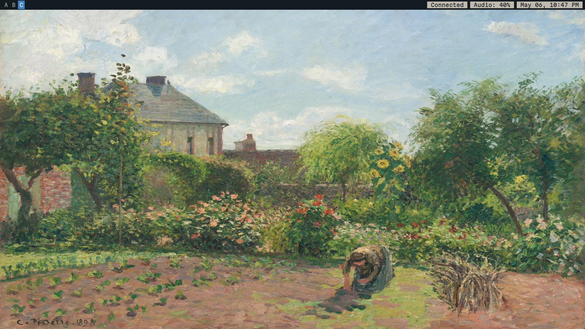

# homeguard



Some sets of my personal configuration in linux.

> The "unmaintained" folder is my archived folder, it hasn't been used for a while so they may or may not work. They are not included in the script.

To install:
```
bash <(wget -qO- https://raw.githubusercontent.com/jgz365/homeguard/main/scripts/setup.sh)
```

Checklist:

Complete: 

- [x] Create the repository
- [x] Add configuration files 
- [x] Add some old configs from my private repos

Script:

- [x] Create an install script
- [x] Include vim configuration 
- [x] Include my dotfiles
- [x] Add an option for NVIDIA Driver installation
- [x] Add my configuration file for Ghostty
- [x] Import a fastfetch preset from the wiki
- [x] Import my configuration file for dunst
- [x] Import my picom config

Incomplete/In Progress:

- [ ] Add my custom bash prompt that detects system age
- [ ] Script re-write - can never feel satisfied
- [ ] Import settings.ini for automatic GTK Theming
- [ ] Better package cleaup (remove package Y pulled by package X)
- [ ] Simple LSP + Syntax Highlighting for Vim, primarily for C Language
- [ ] Improvise script
- [ ] Add an option to make NVIDIA as the primary gpu (for optimus laptops)
- [ ] Test the script
- [ ] Add a logfile(?)

Sources used:
- [i3-starterpack](https://github.com/addy-dclxvi/i3-starterpack)
- [C. Pissarro Artworks](https://www.wikiart.org/en/camille-pissarro)
- [Gentoo Wiki - i3wm](https://wiki.gentoo.org/wiki/I3)
- [Debian Packages](https://www.debian.org/distrib/packages)
- [NVIDIA Graphics Drivers](https://wiki.debian.org/NvidiaGraphicsDrivers)
- [This stackoverflow question](https://stackoverflow.com/questions/40986340/how-to-wget-a-list-of-urls-in-a-text-file)
- [CTT's Debian-titus script](https://github.com/ChrisTitusTech/Debian-titus/blob/main/install.sh)
- [Bash Git Prompt](https://github.com/magicmonty/bash-git-prompt)
- [Bash Syntax](https://www.w3schools.com/bash/bash_syntax.php)
- [Fastfetch](https://github.com/fastfetch-cli/fastfetch)

